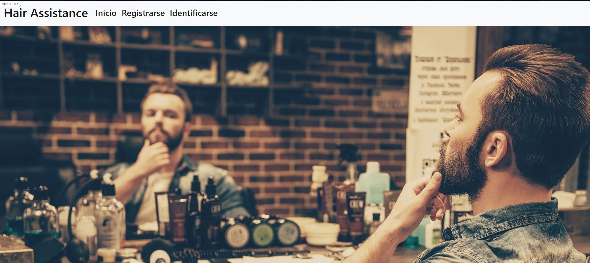
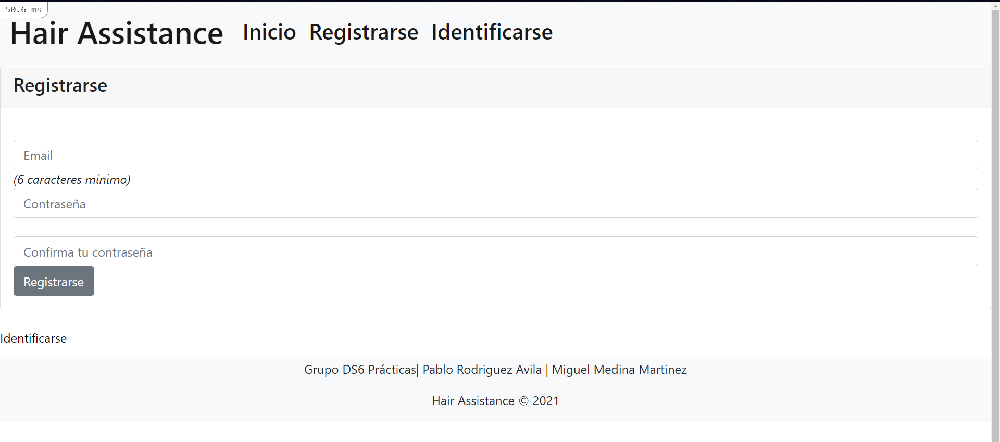
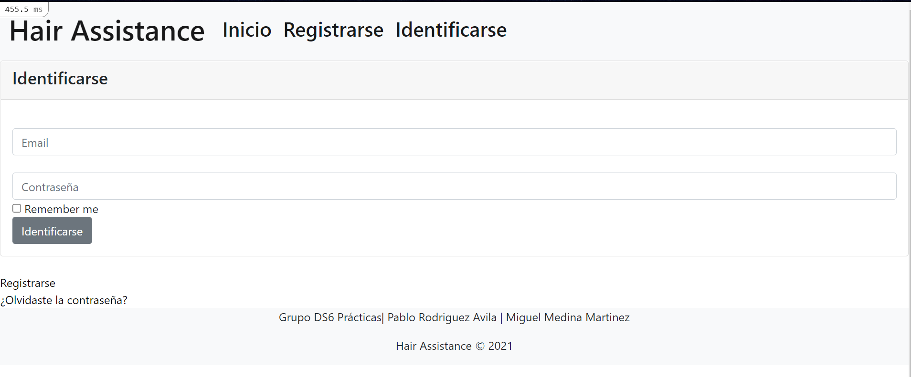
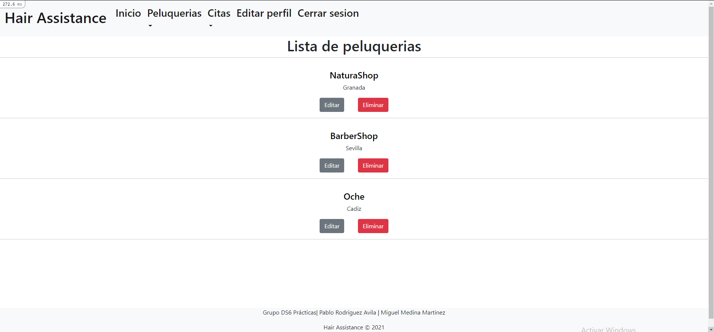
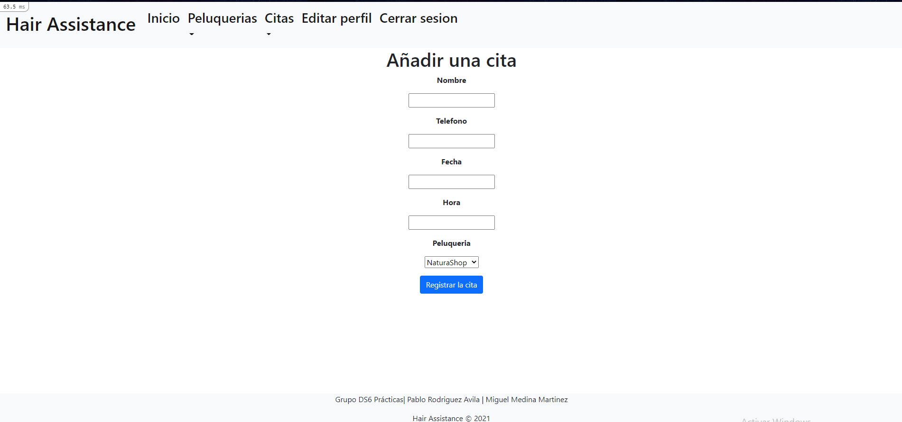

## Hair Assistance

Hair Assistance is an open source project using Ruby on Rails for helping hair dressers manage appointments.

Things you can do:

* Create, edit, delete and upload (CRUD) hair shops with the important information.

* Create, edit, delete and upload (CRUD) appointments in a hair shop with the information of the client.

* Manage access to the platform allowing only hair dressers access to it.

Home page

Sign up page

Login page

List of hair shops

List of appointments

Add an appointment

